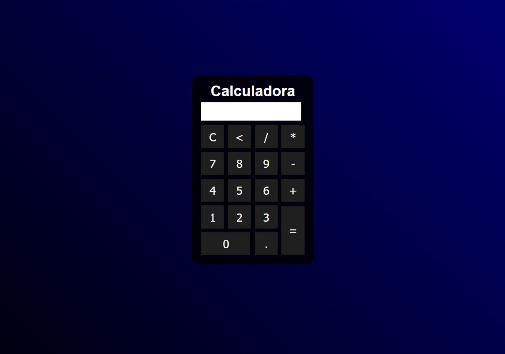

<h1 align="center"> Calculadora </h1>

Projeto ensinado em vídeo de forma pública por Gustavo Neitzke  

- [Visite o tutorial em aula do projeto online](https://www.youtube.com/watch?v=42TShjXR0m0)

  <a href="#-tecnologias">Tecnologias</a>&nbsp;&nbsp;&nbsp;|&nbsp;&nbsp;&nbsp;
  <a href="#-projeto">Projeto</a>&nbsp;&nbsp;&nbsp;|&nbsp;&nbsp;&nbsp;
  <a href="#memo-licença">Licença</a>

  

 

  

## 🚀 Tecnologias

Esse projeto foi desenvolvido com as seguintes tecnologias:

- HTML e CSS
- Javascript
- Git e Github

## 💻 Projeto

A calculadora é um simples projeto produzido com o fim de praticar os primeiros conceitos de front-end, utilizando ferramentas mais básicas que supram a função principal de calcular corretamente números com as operações mais simples da matemática.

- [Visite o projeto online](https://dev-enrico.github.io/Calculadora)

## :memo: Licença

Esse projeto está sob a licença MIT.

---

